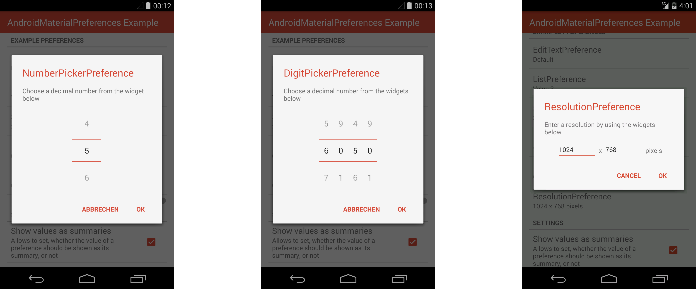
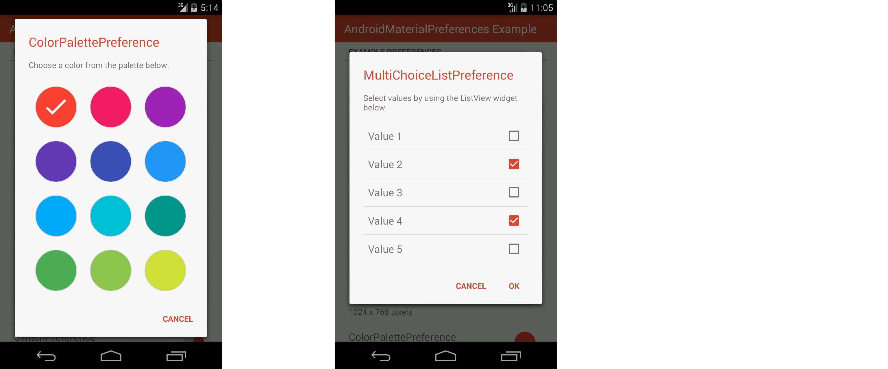

# AndroidMaterialPreferences - README

[](https://android-arsenal.com/api?level=14) [](https://opensource.org/licenses/Apache-2.0) [](https://www.paypal.com/cgi-bin/webscr?cmd=_s-xclick&hosted_button_id=X75YSLEJV3DWE)

"AndroidMaterialPreferences" is an Android-library, which provides various preferences, which are designed according to Android 5's Material Design guidelines even on pre-Lollipop devices.






The library provides the following preferences:

- A preference, which allows to show simple dialogs (`DialogPreference`).
- A preference, which allows to enter a text via an `EditText` widget (`EditTextPreference`).
- A preference, which allows to select a value from a list (`ListPreference`).
- A preference, which allows to select multiple values from a list (`MultiChoiceListPreference`).
- A preference, which allows to choose a floating point value or an integer value from a continuous range via a `SeekBar` widget (`SeekBarPreference`).
- A preference, which allows to choose a decimal value using a `NumberPicker` widget (`NumberPickerPreference`).
- A preference, which allows to choose a decimal value, consisting of individual digits of which each can be chosen using a `NumberPicker` widget (`DigitPickerPreference`).
- A preference, which allows to choose an image or video resolution via two `EditText` widgets (`ResolutionPreference`).
- A preference, which allows to choose a color from a predefined color palette (`ColorPalettePreference`).
- A preference, which provides a toggleable option using a `Switch` widget (`SwitchPreference`).
- A preference, which provides a toggleable option using a `CheckBox` widget (`CheckBoxPreference`.
- A preference, which acts as a button and shows a centered title (`ActionPreference`).

Prior to version 4.0.0 this library relied on the Android SDK's preference classes such as `android.preference.Preference`. As these classes are deprecated starting with Android P, the library has been migrated to use the v14 Preference support library in version 4.0.0 and later.

## License Agreement

This project is distributed under the Apache License version 2.0. For further information about this license agreement's content please refer to its full version, which is available at http://www.apache.org/licenses/LICENSE-2.0.txt.

Prior to version 2.0.4 this library was distributed under the GNU Lesser General Public License version 3.0 (GLPLv3).

## Download

The latest release of this library can be downloaded as a zip archive from the download section of the project's Github page, which is available [here](https://github.com/michael-rapp/AndroidMaterialPreferences/releases). Furthermore, the library's source code is available as a Git repository, which can be cloned using the URL https://github.com/michael-rapp/AndroidMaterialPreferences.git.

Alternatively, the library can be added to your Android app as a Gradle dependency by adding the following to the respective module's `build.gradle` file:

```groovy
dependencies {
    compile 'com.github.michael-rapp:android-material-preferences:5.2.1'
}
```

Before version 2.0.0 this project was hosted on [Sourceforge](https://sourceforge.net/projects/androidmaterialpreferences). These older versions used the legacy Eclipse ADT folder structure and are not available as Gradle artifacts.

## Examples

The following examples provide a quick overview on how to use the preferences, which are provided by the library, in your own Android app. This project also contains the source code of an example app, which implements use cases of the library for demonstration purposes, as well as a more detailed documentation in the Wiki and auto-generated javadoc files.

*Since version 5.0.0 the library requires to use [AndroidX](https://developer.android.com/jetpack/androidx/) instead of the older AppCompat support libraries. Make sure that you have [migrated](https://developer.android.com/jetpack/androidx/migrate) your app to AndroidX and that you are using one of the Material component themes instead of the AppCompat ones, e.g. `Theme.MaterialComponents.Light.DarkActionBar` instead of `Theme.AppCompat.Light.DarkActionBar`.*

### Specifying a theme

Most of the preferences, which are provided by the library show a dialog when the respective preference is clicked. The theme, which should be used for the dialogs, can be specified by using the theme attribute `preferenceDialogTheme`. The library comes with a predefined dark and light theme. When no theme is specified, the light theme is used by default. It can be referenced by using the resource id `@style/MaterialDialog.Light`, the dark theme corresponds to the id `@style/MaterialDialog` instead. In order specify the theme, which should be used, the attribute `preferenceDialogTheme` has to be overwritten in the theme of your app. By extending either one of default themes, which are provided by the library, custom theme attributes such like the attribute `colorAccent`, which is used to specify the default text color of a dialog's buttons, can be overwritten. The following example illustrates how this can be achieved by showing a sample `res/values/styles.xml` file:

```xml
<resources>

    <style name="AppTheme" parent="@style/Theme.MaterialComponents.Light.DarkActionBar">
        <item name="colorPrimary">@color/color_primary</item>
        <item name="colorPrimaryDark">@color/color_primary_dark</item>
        <item name="colorAccent">@color/color_accent</item>
        <item name="preferenceDialogTheme">@style/CustomLightTheme</item>
    </style>

    <style name="CustomLightTheme" parent="@style/MaterialDialog.Light">
        <item name="colorAccent">@color/color_accent</item>
    </style>

</resources>
```

If the theme of one of the preferences used in the app should differ from those used by the other ones, the attribute `custom:dialogThemeResource` can be used when specifying the preference as a XML resource. The examples shown below illustrate the use of this attribute.

### Showing a header

All preferences, which show a dialog, when they are clicked, can show a header at the top of their dialog. The header may contain a background color or image as well as an icon. In order to show such a header, the following XML attributes have to be added to the XML resource, which is used to declare the preference:

```xml
custom:showDialogHeader="true"
custom:dialogHeaderBackground="@drawable/dialog_header_background"
custom:dialogHeaderIcon="@drawable/dialog_header_icon"
```

A preference's dialog, which contains such a header, may look like shown in the screenshot below:


### SeekBarPreference

The XML code below shows how to declare a `SeekBarPreference` as part of a `PreferenceScreen`. The example contains all of the preference's custom attributes.

```xml
<?xml version="1.0" encoding="utf-8"?> 
<PreferenceScreen xmlns:android="http://schemas.android.com/apk/res/android" 
    xmlns:custom="http://schemas.android.com/apk/res-auto" >

    <de.mrapp.android.preference.SeekBarPreference 
        android:defaultValue="33.336" 
        android:dialogTitleColor="@android:color/black" 
        android:dialogMessageColor="@android:color/black" 
        android:dialogButtonTextColor="@android:color/black" 
        android:dialogBackground="@android:color/white" 
        android:dialogMessage="@string/seek_bar_preference_dialog_message" 
        android:dialogTitle="@string/seek_bar_preference_dialog_title" 
        android:key="@string/seek_bar_preference_key" 
        android:max="150" 
        android:summary="@array/seek_bar_preference_summaries" 
        android:title="@string/seek_bar_preference_title" 
        custom:decimals="2" 
        custom:floatingPointSeparator="." 
        custom:min="25" 
        custom:showProgress="true" 
        custom:showValueAsSummary="false" 
        custom:unit="Unit"
        custom:dialogThemeResource="@style/MaterialDialog" /> 

</PreferenceScreen>
```

The following screenshot shows how a `SeekBarPreference` may look like:


### EditTextPreference

The example below shows how the attributes of an `EditTextPreference` can be specified within a XML resource.

```xml
<?xml version="1.0" encoding="utf-8"?> 
<PreferenceScreen xmlns:android="http://schemas.android.com/apk/res/android" 
    xmlns:custom="http://schemas.android.com/apk/res-auto" >

    <de.mrapp.android.preference.EditTextPreference 
        android:defaultValue="DefaultText" 
        android:dialogTitleColor="@android:color/black" 
        android:dialogMessageColor="@android:color/black" 
        android:dialogButtonTextColor="@android:color/black" 
        android:dialogBackground="@android:color/white" 
        android:dialogMessage="@string/edit_text_preference_dialog_message" 
        android:dialogTitle="@string/edit_text_preference_dialog_title" 
        android:key="@string/edit_text_preference_key" 
        android:summary="@string/edit_text_preference_summary" 
        android:title="@string/edit_text_preference_title" 
        custom:showValueAsSummary="false" 
        custom:dialogThemeResource="@style/MaterialDialog" /> 

</PreferenceScreen>
```

The picture shown below show the appearance of a `EditTextPreference`:


### ListPreference

The example illustrates how the attributes of a `ListPreference` can be specified, if the preference should be declared within a XML resource.

```xml
<?xml version="1.0" encoding="utf-8"?> 
<PreferenceScreen xmlns:android="http://schemas.android.com/apk/res/android" 
    xmlns:custom="http://schemas.android.com/apk/res-auto" >

    <de.mrapp.android.preference.ListPreference 
        android:defaultValue=0 
        android:entries="R.array.list_preference_entries" 
        android:entryValues="R.array.list_preference_entry_values" 
        android:dialogTitleColor="@android:color/black" 
        android:dialogMessageColor="@android:color/black" 
        android:dialogButtonTextColor="@android:color/black" 
        android:dialogBackground="@android:color/white" 
        android:dialogItemColor="@android:color/black" 
        android:dialogItemControlColor="@android:color/black" 
        android:dialogMessage="@string/list_preference_dialog_message" 
        android:dialogTitle="@string/list_preference_dialog_title" 
        android:key="@string/list_preference_key" 
        android:summary="@array/list_preference_summary" 
        android:title="@string/list_preference_title" 
        custom:showValueAsSummary="false" 
        custom:dialogThemeResource="@style/MaterialDialog" /> 

</PreferenceScreen>
```

The screenshot below illustrates the appearance of a `ListPreference`:


### MultiChoiceListPreference

The following XML code shows how the attributes of a `MultiChoiceListPreference` can be specified, if the preference should be declared within a XML resource.

```xml
<?xml version="1.0" encoding="utf-8"?> 
<PreferenceScreen xmlns:android="http://schemas.android.com/apk/res/android" 
    xmlns:custom="http://schemas.android.com/apk/res-auto" >

    <de.mrapp.android.preference.MultiChoiceListPreference 
        android:defaultValue="R.array.multi_choice_list_preference_entry_values" 
        android:entries="R.array.multi_choice_list_preference_entries" 
        android:entryValues="R.array.multi_choice_list_preference_entry_values" 
        android:dialogTitleColor="@android:color/black" 
        android:dialogMessageColor="@android:color/black" 
        android:dialogButtonTextColor="@android:color/black" 
        android:dialogBackground="@android:color/white" 
        android:dialogItemColor="@android:color/black" 
        android:dialogItemControlColor="@android:color/black" 
        android:dialogMessage="@string/multi_choice_list_preference_dialog_message" 
        android:dialogTitle="@string/multi_choice_list_preference_dialog_title" 
        android:key="@string/multi_choice_list_preference_key" 
        android:summary="@array/multi_choice_list_preference_summary" 
        android:title="@string/multi_choice_list_preference_title" 
        custom:showValueAsSummary="false" 
        custom:dialogThemeResource="@style/MaterialDialog" /> 

</PreferenceScreen>
```

The screenshot, which is shown in the following, illustrates how a `MultiChoiceListPreference` may look like:


### NumberPickerPreference

The following example illustrates how of a `NumberPickerPreference` can be specified via XML for use within a `PreferenceScreen`.

```xml
<?xml version="1.0" encoding="utf-8"?> 
<PreferenceScreen xmlns:android="http://schemas.android.com/apk/res/android" 
    xmlns:custom="http://schemas.android.com/apk/res-auto" >

    <de.mrapp.android.preference.NumberPickerPreference 
        android:defaultValue="25" 
        custom:min="0" 
        android:max="100" 
        custom:useInputMethod="true" 
        custom:wrapSelectorWheel="false" 
        android:dialogTitleColor="@android:color/black" 
        android:dialogMessageColor="@android:color/black" 
        android:dialogButtonTextColor="@android:color/black" 
        android:dialogBackground="@android:color/white" 
        android:dialogMessage="@string/number_picker_preference_dialog_message" 
        android:dialogTitle="@string/number_picker_preference_dialog_title" 
        android:key="@string/number_picker_preference_key" 
        android:summary="@array/number_picker_preference_summary" 
        android:title="@string/number_picker_preference_title" 
        custom:unit="Unit" 
        custom:stepSize="5" 
        custom:showValueAsSummary="false" 
        custom:dialogThemeResource="@style/MaterialDialog" /> 

</PreferenceScreen>
```

The screenshot below illustes how a `SeekBarPreference` may look like:


### DigitPickerPreference

The following example illustrates how of a `DigitPickerPreference` can be declared within a XML resource.

```xml
<?xml version="1.0" encoding="utf-8"?> 
<PreferenceScreen xmlns:android="http://schemas.android.com/apk/res/android" 
    xmlns:custom="http://schemas.android.com/apk/res-auto" >

    <de.mrapp.android.preference.DigitPickerPreference 
        android:defaultValue="25" 
        custom:numberOfDigits="2" 
        custom:useInputMethod="true" 
        custom:wrapSelectorWheel="false" 
        android:dialogTitleColor="@android:color/black" 
        android:dialogMessageColor="@android:color/black" 
        android:dialogButtonTextColor="@android:color/black" 
        android:dialogBackground="@android:color/white" 
        android:dialogMessage="@string/digit_picker_preference_dialog_message" 
        android:dialogTitle="@string/digit_picker_preference_dialog_title" 
        android:key="@string/digit_picker_preference_key" 
        android:summary="@array/digit_picker_preference_summary" 
        android:title="@string/digit_picker_preference_title" 
        custom:unit="Unit" 
        custom:showValueAsSummary="false" 
        custom:dialogThemeResource="@style/MaterialDialog" /> 

</PreferenceScreen>
```

The image shown below shows the appearance of a `DigitPickerPreference`:


### ResolutionPreference

The following XML code shows how of a `ResolutionPreference` can be declared within a XML resource.

```xml
<?xml version="1.0" encoding="utf-8"?> 
<PreferenceScreen xmlns:android="http://schemas.android.com/apk/res/android" 
    xmlns:custom="http://schemas.android.com/apk/res-auto" >

    <de.mrapp.android.preference.ResolutionPreference 
        android:defaultValue="1024x768" 
        custom:unit=@string/resolution_preference_unit 
        android:dialogTitleColor="@android:color/black" 
        android:dialogMessageColor="@android:color/black" 
        android:dialogButtonTextColor="@android:color/black" 
        android:dialogBackground="@android:color/white" 
        android:dialogMessage="@string/resolution_preference_dialog_message" 
        android:dialogTitle="@string/resolution_preference_dialog_title" 
        android:key="@string/resolution_preference_key" 
        android:summary="@array/resolution_preference_summary" 
        android:title="@string/resolution_preference_title" 
        custom:showValueAsSummary="false" 
        custom:dialogThemeResource="@style/MaterialDialog" /> 

</PreferenceScreen>
```

The following screenshot illustrates the appearance of a `ResolutionPreference`:


### ColorPalettePreference

The following XML structure illustrates how a `ColorPalettePreference` can be specified within a XML resource file.

```xml
<?xml version="1.0" encoding="utf-8"?> 
<PreferenceScreen xmlns:android="http://schemas.android.com/apk/res/android" 
    xmlns:custom="http://schemas.android.com/apk/res-auto" >

    <de.mrapp.android.preference.ColorPalettePreference 
        android:defaultValue="@color/red" 
        custom:showPreview="true" 
        custom:previewSize="@dimen/preview_size" 
        custom:previewShape="square" 
        custom:previewBorderWidth="@dimen/preview_border_width" 
        custom:previewBorderColor="@color/preview_border_color" 
        custom:previewBackground="@drawable/preview_background" 
        custom:colorFormat="rgb" 
        custom:dialogPreviewSize="@dimen/dialog_preview_size" 
        custom:dialogPreviewShape="square" 
        custom:dialogPreviewBorderWidth="@dimen/dialog_preview_border_width" 
        custom:dialogPreviewBorderColor="@color/dialog_preview_border_color" 
        custom:dialogPreviewBackground="@drawable/dialog_preview_background" 
        custom:numberOfColumns="2" 
        custom:colorPalette="@array/color_palette" 
        android:dialogTitleColor="@android:color/black" 
        android:dialogMessageColor="@android:color/black" 
        android:dialogButtonTextColor="@android:color/black" 
        android:dialogBackground="@android:color/white" 
        android:dialogMessage="@string/color_palette_preference_dialog_message" 
        android:dialogTitle="@string/color_palette_preference_dialog_title" 
        android:key="@string/color_palette_preference_key" 
        android:summary="@array/color_palette_preference_summary" 
        android:title="@string/color_palette_preference_title" 
        custom:showValueAsSummary="false" 
        custom:dialogThemeResource="@style/MaterialDialog" /> 

</PreferenceScreen>
```

A `ColorPalettePreference` may look like shown in the screenshot below:


### SwitchPreference

The following XML code shows how a `SwitchPreference` can be declared within a XML resource.

```xml
<?xml version="1.0" encoding="utf-8"?> 
<PreferenceScreen xmlns:android="http://schemas.android.com/apk/res/android" 
    xmlns:custom="http://schemas.android.com/apk/res-auto" >

    <de.mrapp.android.preference.SwitchPreference 
        android:defaultValue="true" 
        android:summaryOn=@string/summary_on 
        android:summaryOff=@string/summary_off 
        android:disableDependentsState=true 
        android:switchTextOn=@string/switch_text_on 
        android:switchTextOff=@string/switch_text_off 
        android:key="@string/switch_preference_key"
        android:summary="@array/switch_preference_summary" 
        android:title="@string/switch_preference_title" 
        custom:showValueAsSummary="false" /> 

</PreferenceScreen>
```

### CheckBoxPreference

The following example shows how a `CheckBoxPreference` can be declared within a XML resource.

```xml
<?xml version="1.0" encoding="utf-8"?>
<PreferenceScreen xmlns:android="http://schemas.android.com/apk/res/android"
    xmlns:custom="http://schemas.android.com/apk/res-auto" >

    <de.mrapp.android.preference.CheckBoxPreference
        android:defaultValue="true"
        android:summaryOn=@string/summary_on
        android:summaryOff=@string/summary_off
        android:disableDependentsState=true
        android:key="@string/switch_preference_key"
        android:summary="@array/switch_preference_summary"
        android:title="@string/switch_preference_title"
        custom:showValueAsSummary="false" />

</PreferenceScreen>
```

## Contact information

For personal feedback or questions feel free to contact me via the mail address, which is mentioned on my [Github profile](https://github.com/michael-rapp). If you have found any bugs or want to post a feature request please use the [bugtracker](https://github.com/michael-rapp/AndroidMaterialPreferences/issues) to report them.
